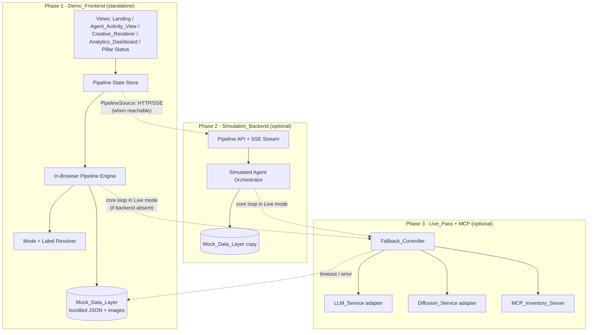
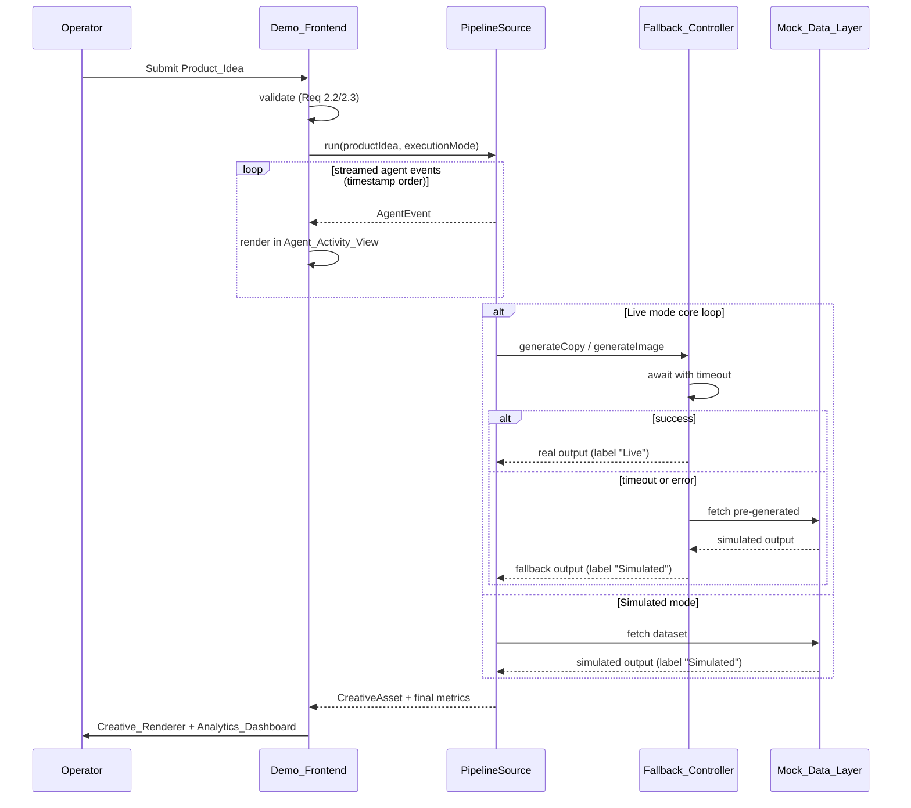

# Design Document

## Overview

AInigma is a hackathon prototype that presents an autonomous multi-agent multimodal marketing content engine. The Operator types a raw `Product_Idea`, watches a simulated `Agent_Swarm` collaborate in real time, and receives a multimodal `Creative_Asset` (marketing copy + hero image), alongside a synthetic `Analytics_Dashboard`.

The defining design constraint is that this is **demo-focused and frontend-aesthetics-first**, not production. The architecture is therefore organized around three independently shippable layers that map directly to the build phases in Requirement 13:

- **Phase 1 — Demo_Frontend (must-have):** A polished React single-page application that runs a *complete* pipeline using only a bundled `Mock_Data_Layer`. It has no backend dependency and makes zero network requests. This is the primary judged artifact (Req 1, 13.1, 13.4).
- **Phase 2 — Simulation_Backend (medium):** A lightweight Node service that orchestrates the same simulated pipeline server-side and *streams* agent events to the frontend, so the system behaves like a wired application. If it is absent or unreachable, the frontend silently falls back to running the pipeline in-browser (Req 7, 13.2).
- **Phase 3 — Live_Pass + MCP (stretch/optional):** A single real pass through the core loop — one real `LLM_Service` copy call and one real `Diffusion_Service` hero-image call — plus an optional `MCP_Inventory_Server` reading a local file. Every real integration sits behind a swappable interface with a guaranteed mock fallback (Req 8, 9, 10, 13.3, 13.5).

Two cross-cutting concerns govern the entire system:

1. **Honest labeling (Req 11, 14.5):** Every output carries a `Mode_Indicator` of `"Live"` or `"Simulated"` derived from the actual source that produced it. There is one authoritative function that decides the label; the UI never hard-codes it.
2. **Never crash on stage (Req 12):** A `Fallback_Controller` wraps every fallible operation (backend call, LLM, diffusion, MCP) with a timeout and error guard. On any failure it substitutes pre-generated/simulated content and re-labels the output `"Simulated"`. A full Simulated run requires no network at all.

### Design Goals and Non-Goals

| Goal | Approach |
| --- | --- |
| Phase 1 ships and demos standalone | Frontend bundles the `Mock_Data_Layer`; pipeline engine runs in-browser by default |
| Phases layer without breaking earlier phases | A single `PipelineSource` interface; backend and live capabilities are pluggable implementations |
| Explicit real-vs-simulated boundary | `Execution_Mode`, `Mode_Indicator`, and `Fallback_Controller` are first-class components |
| Demo never crashes | Every fallible call is wrapped with timeout + error fallback to mock data |
| Fast to build for a hackathon team | React + Vite + TypeScript + Tailwind + Framer Motion; Node + Fastify backend; thin SDK adapters |

**Non-Goals:** real user accounts, persistence beyond local files, scalable infrastructure, real RAG vector store (simulated), production security hardening, multi-resolution responsive layout (target is fixed 1920x1080 per Req 1.4).

### Recommended Technology Stack

The team is on Windows/cmd. The stack below is chosen for speed of assembly and a high-tech aesthetic ceiling.

- **Frontend:** React 18 + Vite + TypeScript, Tailwind CSS for the visual system, Framer Motion for scripted transitions/agent animations, Recharts for the `Analytics_Dashboard` visualizations, Zustand for lightweight pipeline state.
- **Backend (Phase 2):** Node 20 + Fastify + TypeScript, Server-Sent Events (SSE) for one-way agent event streaming (simpler than WebSockets, ideal for a unidirectional stream).
- **Live integrations (Phase 3):** `LLM_Service` via a provider SDK behind an adapter (e.g. OpenAI/Anthropic-compatible); `Diffusion_Service` via Replicate, chosen because it needs no local GPU and is a single hosted call ([prototyping with Replicate](https://markaicode.com/vs/replicate-vs-nextjs/)). Content rephrased for compliance with licensing restrictions.
- **MCP (Phase 3):** Official MCP TypeScript SDK `@modelcontextprotocol/sdk` ([npm](https://www.npmjs.com/package/@modelcontextprotocol/sdk)) for the `MCP_Inventory_Server` reading a local JSON/SQLite file.

All real integrations are isolated behind interfaces (`CopyGenerator`, `ImageGenerator`, `InventoryProvider`) so a missing API key or SDK simply means the mock implementation is used.

## Architecture

### Layered Architecture



### PipelineSource Abstraction

The frontend talks to a single interface, `PipelineSource`, that yields a stream of `AgentEvent`s and a final `CreativeAsset`. Two implementations exist:

- `LocalPipelineSource` — runs the simulated pipeline entirely in-browser from the bundled `Mock_Data_Layer` (Phase 1, and the Phase 2 fallback per Req 7.5).
- `RemotePipelineSource` — connects to the `Simulation_Backend` over HTTP + SSE (Phase 2).

At startup the frontend probes the backend health endpoint once with a short timeout. If healthy, it uses `RemotePipelineSource`; otherwise it transparently uses `LocalPipelineSource`. This single switch is what guarantees Phase 1 independence and Phase 2 graceful degradation (Req 7.5, 12.1, 13.2).



### Execution Mode and Labeling Flow

`Execution_Mode` is a per-run setting (`"Simulated"` default, `"Live"` only when the Live_Pass is enabled). But the *label* on each individual output is decided per-output by its actual source, not by the run mode. This distinction is what keeps labeling honest when a Live run falls back mid-flight (Req 11.5, 8.4, 9.3, 10.5): the run may be "Live" while the hero image is labeled "Simulated" because diffusion timed out.

### Build-Phase Independence

Each phase is gated by capability flags resolved at runtime (`backendAvailable`, `livePassEnabled`, `mcpEnabled`). All default to the safest value, so an unconfigured checkout runs a complete Phase 1 demo (Req 13.4). No phase's code path is required by an earlier phase.

## Components and Interfaces

### Frontend Components

| Component | Responsibility | Requirements |
| --- | --- | --- |
| `AppShell` | Global theme, fixed 1920x1080 layout frame, routing between views, persistent pillar status bar | 1.1, 1.4, 11.4 |
| `LandingView` | `Product_Idea` text input, preset selector (≥3), validation, launch trigger | 2.1–2.5 |
| `AgentActivityView` | Renders 5 named agents, streamed log animation in timestamp order, active/complete indicators, handoffs, playback-speed control | 3.1–3.7, 14.2, 14.3 |
| `CreativeRenderer` | Displays final `Creative_Asset` (headline/body/CTA + hero image) in on-brand layout, per-output `Mode_Indicator`, restart control | 4.1–4.5, 14.4 |
| `AnalyticsDashboard` | ≥3 synthetic visualizations (market / audience / predicted performance) with titles + axis labels, "Simulated" label | 5.1–5.4 |
| `PillarStatusPanel` | Lists MCP, RAG, Diffusion, Agentic, LLM with current `Execution_Mode` | 11.4, 14.1, 14.5 |
| `ModeIndicator` | Reusable badge that renders "Live"/"Simulated" for any output | 11.1–11.3 |
| `PipelineStateView` | Defined fallback view for every pipeline state (idle/running/complete/error) so UI is never blank | 12.2 |

### Frontend Logic Modules (pure, testable)

These are the units that property-based tests target.

```typescript
// Product_Idea validation (Req 2.2, 2.3)
function isValidProductIdea(raw: string): boolean;        // true iff >=1 non-whitespace char
function normalizeProductIdea(raw: string): string;       // trims, collapses internal whitespace

// Mock dataset resolution (Req 6.3, 6.4)
function resolveDataset(idea: string, presets: PresetDataset[]): MockDataset;
// returns matching preset dataset, else the default curated dataset (never undefined)

// Honest label resolution (Req 11.1-11.3, 11.5)
type OutputSource = "mock" | "live-service";
function resolveLabel(source: OutputSource): ModeLabel;    // "live-service" -> "Live", else "Simulated"

// Agent event ordering (Req 3.2, 7.2)
function orderEvents(events: AgentEvent[]): AgentEvent[];   // stable sort by simulated timestamp

// Playback speed (Req 3.6)
function scaleEventDelays(events: AgentEvent[], speed: number): AgentEvent[]; // delay/speed, order preserved
```

### Fallback_Controller Interface

The single guard around every fallible operation (Req 8.4, 9.3, 9.4, 10.5, 12.1).

```typescript
interface FallbackResult<T> {
  value: T;
  label: ModeLabel;          // "Live" on success, "Simulated" on fallback
  fellBack: boolean;
  reason?: "timeout" | "error" | "disabled";
}

interface FallbackController {
  run<T>(opts: {
    enabled: boolean;                 // capability flag (e.g. livePassEnabled)
    timeoutMs: number;                // 20000 LLM, 60000 diffusion, 10000 MCP
    attempt: () => Promise<T>;        // the real-service call
    fallback: () => T;                // pre-generated/simulated substitute (always succeeds)
  }): Promise<FallbackResult<T>>;
}
```

Behavior: if `enabled` is false → immediately return fallback labeled `"Simulated"` (Req 8.5, 10.4). Otherwise race `attempt()` against `timeoutMs`; on resolve → `"Live"`; on timeout or thrown error → fallback labeled `"Simulated"` (Req 8.4, 9.3, 9.4, 10.5).

### Swappable Real-Service Adapters (Phase 3)

```typescript
interface CopyGenerator { generate(idea: string): Promise<MarketingCopy>; }      // LLM_Service
interface ImageGenerator { generate(prompt: string): Promise<ImageRef>; }        // Diffusion_Service
interface InventoryProvider { getContext(idea: string): Promise<InventoryRecord[]>; } // MCP

// Mock implementations always exist; real implementations are wired only when keys/flags present.
```

### Simulation_Backend Interface (Phase 2)

```
GET  /health                      -> { status: "ok", capabilities: {...} }   // probe for source selection
POST /pipeline/run                -> { runId }                                // start simulated run (Req 7.1)
GET  /pipeline/:runId/events      -> text/event-stream of AgentEvent (Req 7.2, timestamp order)
GET  /pipeline/:runId/asset       -> CreativeAsset (final)                    // Req 7.3
```

The backend sources all content from its own copy of the `Mock_Data_Layer` and calls no external endpoint in Simulated mode (Req 7.4). Live core-loop calls are delegated to the same `Fallback_Controller` + adapters used by the frontend.

### MCP_Inventory_Server (Phase 3)

A standalone process built with `@modelcontextprotocol/sdk` exposing an `inventory` tool/resource that reads a local `inventory.json` (or SQLite) file (Req 10.1, 10.2). The pipeline accesses it through the `InventoryProvider` interface, so when MCP is disabled or times out the mock provider supplies "Simulated"-labeled inventory (Req 10.4, 10.5).

## Data Models

```typescript
type ModeLabel = "Live" | "Simulated";
type ExecutionMode = "Simulated" | "Live";
type TechPillar = "MCP" | "RAG" | "Diffusion" | "Agentic" | "LLM";
type AgentName = "Researcher" | "Analyst" | "Copywriter" | "Visual_Director" | "Operations";
type PipelineState = "idle" | "running" | "complete" | "error";

interface AgentEvent {
  id: string;
  agent: AgentName;
  timestamp: number;          // simulated ms offset from run start; ordering key
  kind: "log" | "active" | "complete" | "handoff";
  message: string;
  handoffTo?: AgentName;       // present when kind === "handoff"
  pillar?: TechPillar;         // attribution for pillar showcase (Req 14.2)
  delayMs?: number;            // scheduling delay used for animation pacing
}

interface MarketingCopy { headline: string; body: string; cta: string; }

interface ImageRef { src: string; alt: string; }   // local path (mock) or URL (live)

interface CreativeAsset {
  copy: MarketingCopy;
  copyLabel: ModeLabel;        // per-output label (Req 4.4, 8.3, 8.4)
  hero: ImageRef;
  heroLabel: ModeLabel;        // per-output label (Req 9.2, 9.3)
}

interface MetricSeries { id: string; title: string; xLabel: string; yLabel: string; points: { x: string; y: number }[]; }

interface AnalyticsBundle {
  market: MetricSeries;
  audience: MetricSeries;
  predictedPerformance: MetricSeries;
  label: ModeLabel;            // always "Simulated" (Req 5.3)
}

interface InventoryRecord { sku: string; name: string; stock: number; attributes: Record<string, string>; }

interface MockDataset {
  presetId: string;            // "default" for the fallback dataset
  matchKeywords: string[];     // used by resolveDataset
  agentScript: AgentEvent[];   // full simulated collaboration (Req 6.1)
  copy: MarketingCopy;
  heroImage: ImageRef;         // pre-generated, local (Req 9.5)
  analytics: AnalyticsBundle;
  inventory: InventoryRecord[];
}

interface PresetDataset extends MockDataset { exampleLabel: string; }   // shown in LandingView (Req 2.4)

interface PillarStatus { pillar: TechPillar; mode: ExecutionMode; }     // Req 11.4, 14.5

interface PipelineRun {
  runId: string;
  productIdea: string;
  executionMode: ExecutionMode;
  state: PipelineState;
  dataset: MockDataset;
  asset?: CreativeAsset;
  pillarStatuses: PillarStatus[];
}
```

### Capability Flags

```typescript
interface Capabilities {
  backendAvailable: boolean;   // resolved by /health probe
  livePassEnabled: boolean;    // env/UI toggle, default false
  mcpEnabled: boolean;         // env/UI toggle, default false
}
```

All flags default to the safe value so an unconfigured build runs a full Phase 1 demo (Req 13.4).

## Correctness Properties

*A property is a characteristic or behavior that should hold true across all valid executions of a system — essentially, a formal statement about what the system should do. Properties serve as the bridge between human-readable specifications and machine-verifiable correctness guarantees.*

These properties target the pure logic layer of AInigma (validation, dataset resolution, labeling, event scheduling, fallback control, and run-output invariants). UI rendering, animation aesthetics, layout, and the timing-on-the-demo-machine criteria are intentionally excluded from PBT and are covered by example/snapshot/integration tests in the Testing Strategy.

### Property 1: Product_Idea validity is exactly presence of a non-whitespace character

*For any* input string, `isValidProductIdea` returns true if and only if the string contains at least one non-whitespace character; a valid idea starts the pipeline and an invalid (empty or all-whitespace) idea does not.

**Validates: Requirements 2.2, 2.3**

### Property 2: Dataset resolution is total

*For any* Product_Idea string and any set of presets, `resolveDataset` returns a defined `MockDataset`; when no preset matches, it returns the default curated dataset.

**Validates: Requirements 6.4**

### Property 3: Presets are distinct and curated

*For any* configured set of preset datasets, all `presetId` values are unique and each preset maps to its own curated dataset.

**Validates: Requirements 6.3**

### Property 4: Honest label resolution

*For any* output, `resolveLabel` returns `"Live"` if and only if the output's source is a real service, and `"Simulated"` for any mock-sourced output; every produced output carries exactly one label drawn from {`"Live"`, `"Simulated"`}.

**Validates: Requirements 4.4, 11.1, 11.2, 11.3**

### Property 5: Fallback_Controller guarantees a usable output with an honest label

*For any* guarded operation, the `Fallback_Controller` returns a usable value: when the capability is enabled and the real attempt resolves before its timeout, the value is the real result labeled `"Live"`; when the capability is disabled, or the attempt exceeds its timeout, or the attempt throws an error, the value is the fallback substitute labeled `"Simulated"` and `fellBack` is true. This holds for the LLM (20s), Diffusion (60s), and MCP (10s) timeouts.

**Validates: Requirements 8.3, 8.4, 8.5, 9.2, 9.3, 9.4, 10.4, 10.5, 11.5, 12.1**

### Property 6: Live core loop performs exactly one real invocation per service

*For any* Product_Idea run in Live Execution_Mode with the capability enabled and the service responding successfully, each real adapter (`CopyGenerator`, `ImageGenerator`) is invoked exactly once.

**Validates: Requirements 8.2, 9.1**

### Property 7: Agent events are streamed in timestamp order

*For any* list of `AgentEvent`s, `orderEvents` produces a sequence that is a permutation of the input (no events added or lost) and is sorted non-decreasingly by simulated timestamp; this holds for both the local engine and the backend stream.

**Validates: Requirements 3.2, 7.2**

### Property 8: Playback speed scales delays while preserving order

*For any* list of events and any playback speed greater than zero, `scaleEventDelays` divides each event's delay by the speed and preserves the relative ordering of events.

**Validates: Requirements 3.6**

### Property 9: A full simulated collaboration fits within 90 seconds at default speed

*For any* curated dataset, the sum of scheduled event delays at the default playback speed does not exceed 90,000 milliseconds.

**Validates: Requirements 3.7**

### Property 10: Completed runs always produce a complete, valid Creative_Asset

*For any* completed pipeline run — across any dataset, any Execution_Mode, and any combination of fallback outcomes — the resulting `CreativeAsset` contains marketing copy with non-empty headline, body, and call-to-action, a hero image reference, and a valid `Mode_Indicator` label on both the copy and the hero.

**Validates: Requirements 4.1, 4.2, 12.3, 14.4**

### Property 11: Analytics integrity

*For any* pipeline run, the analytics displayed equal the run dataset's `AnalyticsBundle`, the bundle's label is `"Simulated"`, and every metric series carries a non-empty title and non-empty x/y axis labels.

**Validates: Requirements 5.2, 5.3, 5.4**

### Property 12: Datasets are complete enough to finish a run

*For any* dataset (preset or default), the agent script is non-empty and the dataset includes marketing copy, a locally-stored pre-generated hero image, and an analytics bundle sufficient to complete a full run.

**Validates: Requirements 6.1, 9.5**

### Property 13: Agent and pillar coverage within a run

*For any* curated dataset, every one of the 5 named agents (Researcher, Analyst, Copywriter, Visual_Director, Operations) appears at least once, every non-terminal agent has at least one handoff to a later agent, every RAG-attributed event is attributed to the Researcher agent, and the run represents all 5 tech pillars each with a valid Execution_Mode.

**Validates: Requirements 3.5, 11.4, 14.1, 14.2, 14.3, 14.5**

### Property 14: Simulated runs require no network

*For any* Product_Idea executed in Simulated Execution_Mode, the complete pipeline run issues zero network requests.

**Validates: Requirements 6.5, 7.4, 12.4, 13.1, 13.4**

### Property 15: Every pipeline state has a defined view

*For any* `PipelineState` value (idle, running, complete, error), the frontend resolves a defined view, so the UI is never blank.

**Validates: Requirements 12.2**

### Property 16: Local and remote pipeline sources are equivalent

*For any* Product_Idea, running through `RemotePipelineSource` (backend) and `LocalPipelineSource` (in-browser) over the same dataset yields equivalent ordered agent events and an equivalent final `CreativeAsset`, so delivering Phase 2 preserves Phase 1 behavior.

**Validates: Requirements 13.2**

## Error Handling

The system treats failure as an expected, routine condition rather than an exception, because the overriding requirement is that the demo never crashes (Req 12).

| Failure scenario | Detection | Handling | Resulting label |
| --- | --- | --- | --- |
| Backend unreachable at startup | `/health` probe timeout | Use `LocalPipelineSource` for the whole session (Req 7.5, 13.2) | n/a (still Simulated content) |
| Backend drops mid-stream | SSE error/close event | Resume run locally from the same dataset; continue from last event index | Simulated |
| LLM_Service timeout (>20s) or error | `Fallback_Controller` race/catch | Substitute pre-generated copy | Simulated (Req 8.4) |
| Diffusion_Service timeout (>60s) or error | `Fallback_Controller` race/catch | Substitute pre-generated hero image for the dataset | Simulated (Req 9.3, 9.4) |
| MCP_Inventory_Server disabled/timeout (>10s)/error | flag check + race/catch | Supply inventory from `Mock_Data_Layer` | Simulated (Req 10.4, 10.5) |
| Invalid Product_Idea (empty/whitespace) | `isValidProductIdea` | Inline prompt, do not start pipeline | n/a (Req 2.3) |
| Idea matches no preset | `resolveDataset` | Use default curated dataset | Simulated (Req 6.4) |
| Unexpected runtime error in a view | React error boundary | Render the defined `PipelineStateView` for the current state; keep controls live | n/a (Req 12.2) |

Principles:
- **Every fallible call is wrapped.** No real-service call is made outside the `Fallback_Controller`, so there is no unguarded path that can throw to the UI.
- **Fallback is always available.** Each dataset bundles a complete substitute (copy, hero image, analytics, inventory), so the fallback function never itself fails (Req 9.5, 12.3).
- **Labels follow the source, not the intent.** When a fallback fires, the affected output is relabeled `"Simulated"` even within a Live run (Req 11.5).
- **Restart is always safe.** Restart resets the store to `idle` and returns to a ready state within 3 seconds (Req 12.5, 4.5).

## Testing Strategy

A dual approach: example/snapshot/integration tests for UI, timing, and wiring; property-based tests for the pure logic layer.

### Property-Based Testing

PBT applies to AInigma's logic core (validation, dataset resolution, labeling, event scheduling, fallback control, run invariants). It does **not** apply to visual theming, animation feel, layout at 1920x1080, or load-time-on-the-demo-machine criteria — those use snapshot, example, and manual tests.

- **Library:** `fast-check` with Vitest (matches the React/Vite/TypeScript stack).
- **Iterations:** each property test runs a minimum of 100 generated cases.
- **Traceability:** each property test is tagged with a comment referencing its design property, using the format:
  `// Feature: ainigma-content-engine, Property {number}: {property_text}`
- **One test per property:** each of Properties 1–16 is implemented by a single property-based test. Async/time-based properties (Property 5, 6, 14) use fake timers / injected clocks and mocked adapters so timeouts (20s/60s/10s) are simulated without real waiting and without real network calls.
- **Generators:** custom arbitraries for `Product_Idea` strings (including unicode whitespace and mixed content), `AgentEvent` lists (varying agents, timestamps, kinds), `MockDataset`s, and fallback outcome combinations (success/timeout/error/disabled).

### Example-Based Unit Tests

Concrete scenarios that are not universal:
- Preset count ≥ 3 and each preset launches the pipeline (Req 2.4).
- The 5 named agents render with active and completion indicators (Req 3.1, 3.3, 3.4).
- Restart control returns the app to ready state (Req 4.5, 12.5).
- Default capabilities resolve `Execution_Mode` to `"Simulated"` (Req 13.3).
- With `livePassEnabled`, the Live-mode control is present (Req 8.1).

### Snapshot / Visual Tests

- Cohesive theme and on-brand layouts (Req 1.1, 4.3) via component snapshots at the 1920x1080 viewport (Req 1.4).
- Animation/transition duration configuration assertions (Req 1.3 ≤ 2s, Req 2.5 ≤ 2s).

### Integration Tests

- Phase 1 standalone: full pipeline completes with backend disabled (Req 1.6, 13.1).
- Phase 2 contract: `/health`, `/pipeline/run`, SSE event stream, and `/pipeline/:runId/asset` behave per interface and stream in timestamp order (Req 7.1, 7.3).
- Backend-down fallback: frontend completes a run locally when the backend is unavailable (Req 7.5).
- MCP server (1–2 examples): reads a sample local inventory file and exposes it over the protocol; inventory appears in the Agent_Activity_View when enabled (Req 10.1, 10.2, 10.3).

### Smoke Tests (single execution)

- Landing view loads within 3 seconds on the demo machine (Req 1.2).
- Theme/typography/palette consistency review across views (Req 1.1).

### Manual Demo Rehearsal

A scripted run-through covering each preset and the Live_Pass, deliberately forcing each fallback path (kill backend, revoke API key, disable MCP) to confirm the demo continues and re-labels outputs `"Simulated"` (Req 12).
