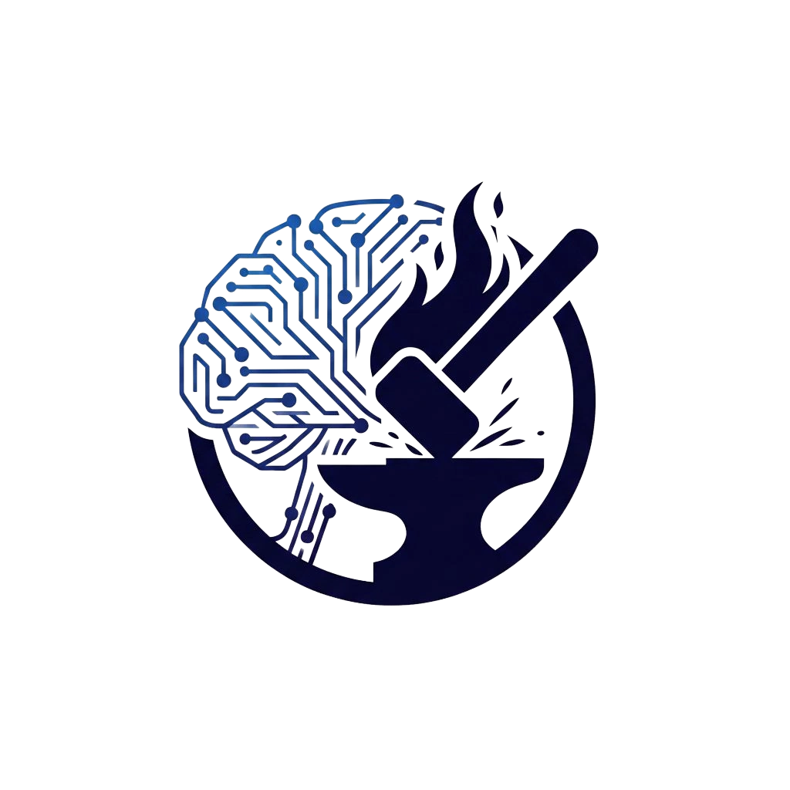

<div align="center">


<br/>



# AIgnis

### From one idea to a launched, self-optimizing campaign.

An autonomous, multi-agent marketing engine — describe a product in a sentence
and a swarm of AI agents researches, writes, designs, films, ships, and optimizes
the whole campaign.

<br/>


**[Live demo →](https://a-ignis.vercel.app)**  ·  Built by **Team AInigma** · Infinity AI BuildFest 2026

</div>

---

Most small brands can't afford a marketing team, and the generic AI tools they
reach for don't know anything about their actual business. AIgnis is our answer:
you describe a product in a sentence, and a team of AI agents takes it from there,
researching the market, writing the copy, designing the creative, cutting the
video, publishing it, and then watching how it performs and improving it.

## What it does

You give it an idea. Five agents pick it up and pass work between them:

- **Researcher** digs through market signals and reviews for the angle that lands.
- **Analyst** pulls your real inventory, pricing, and margins through a private MCP connection.
- **Copywriter** writes in your brand's voice and picks the line that resonates.
- **Visual Director** renders the hero image to your palette with a diffusion model.
- **Operations** assembles the channel-ready reels and voiceover, then ships it.

After launch it doesn't go quiet. The Pulse view reads what's actually happening
on each channel, the Analyst explains it in plain language, and a single click
sends the swarm back in to rewrite what isn't working.

Two things keep it honest. A brand knowledge graph holds the rules, audiences,
and compliance constraints the agents have to respect, and every piece of output
is labelled so you always know whether it came from a live model or a fallback.

## Campaigns it generates

Real creatives produced by the engine — copy, hero image, and channel-ready reels:

<p align="center">
  
  
  
  
  
</p>

## Running it

The web app:

```bash
npm install
npm run dev
```

That opens on http://localhost:5173. It works on its own straight away, using the
built-in demo engine, so you don't need anything else to try it.

To run it against the real backend:

```bash
cd server
npm install
npm run dev      # API on http://localhost:8787
```

When the backend is up, the app detects it and the **Live / Demo** switch in the
header turns on. Live runs the pipeline through the backend (real model calls
where keys are configured); Demo runs everything locally. If a live run ever hits
a snag, the app quietly drops back to Demo so a presentation never stalls.

The five MCP servers run on their own over stdio — see `server/README.md`.

## How it's put together

```
src/                      the web app (React + Vite + TypeScript)
  components/
    layout/               shell, sidebar, header, brand
    ui/                   small shared pieces (badges, charts, icons)
    features/             the bigger domain pieces (agent graph, reels, hero)
  views/                  the pages
  stores/                 app state (auth, pipeline, connection, nav...)
  data/                   demo datasets
  lib/                    api client, sound, speech
server/                   the backend (Node + Fastify)
  src/
    routes/               HTTP + streaming endpoints
    services/             the domain logic (orchestrator, graph, pulse...)
    adapters/             swappable model + inventory providers
    mcp/                  five MCP servers
automation/               n8n workflows
docs/                     engineering notes
.kiro/specs/              the spec we built from
```

## The stack

The front end is React, Vite, TypeScript and Tailwind, with Framer Motion for the
animation and Recharts for the dashboards. The backend is Node and Fastify, and it
streams the agent run to the browser over Server-Sent Events. For the models we
lean on free options: Llama 3 through Ollama, Groq or OpenRouter for text, and
FLUX or SDXL through Hugging Face or Pollinations for images. The MCP servers use
the official Model Context Protocol SDK. We built the whole thing spec-first in Kiro.

## A note on data

We use Neon (serverless Postgres) with pgvector as the target store for users,
campaigns, and the embeddings behind retrieval. The plan and the migration path
are written up in `docs/DATABASE.md`.
